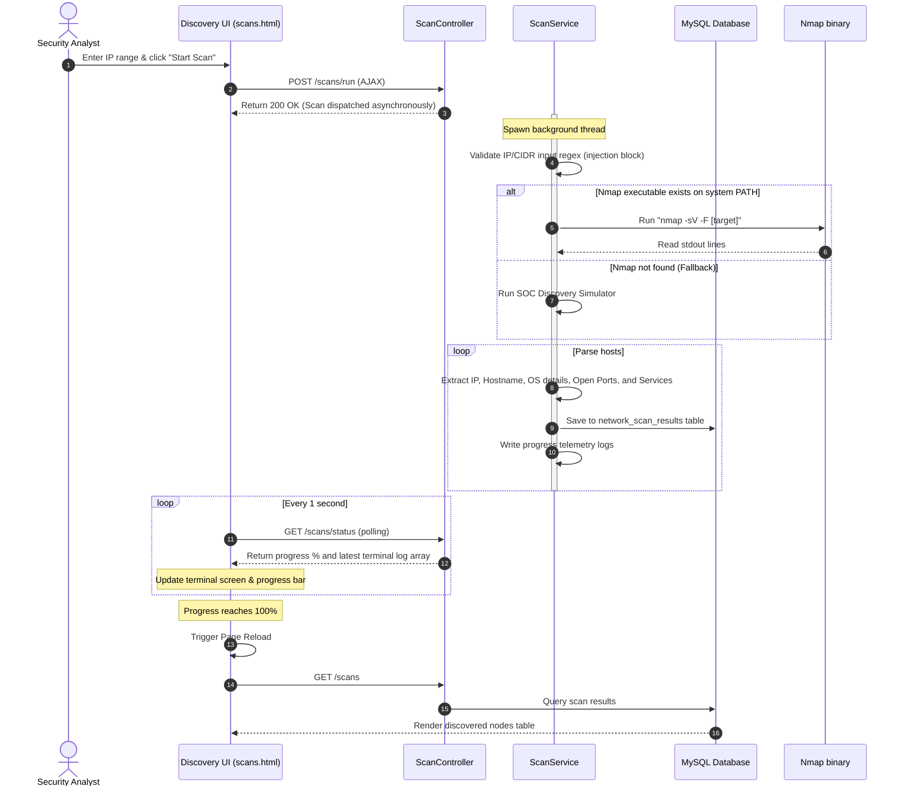
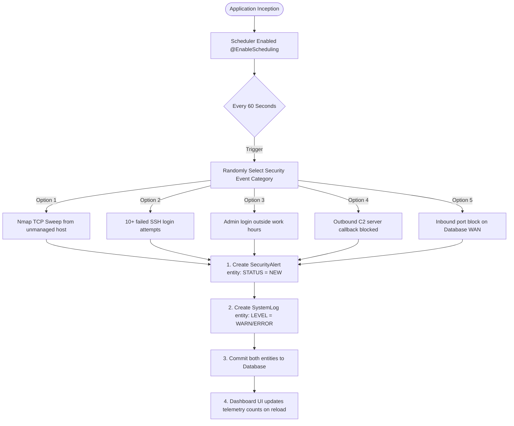
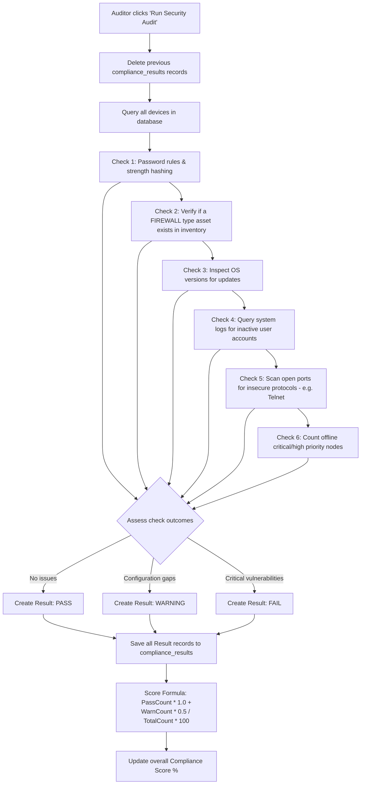

# Secure Enterprise Network Monitoring and Compliance Management System
## System Architecture, Design, and Directory Blueprint

This documentation provides an in-depth explanation of the **Secure Enterprise Network Monitoring and Compliance Management System**. It outlines what the project is, how it operates, the architectural workflows, and a detailed map explaining which files are responsible for what functions in the project directories.

---

## 1. Executive Summary & Purpose

Modern corporate networks require real-time synchronization between three security operations entities:
1. **Network Operations Center (NOC)**: Focuses on asset inventory, online status, device categorization, and service availability.
2. **Security Operations Center (SOC)**: Ingests IDS/IPS network logs, handles alert triaging, monitors vulnerabilities, and investigates anomalous behaviors (e.g. brute-forcing, network port sweeps, rogue devices).
3. **Compliance Audit Team**: Audits internal systems against strict standards (like ISO 27001, CIS Benchmarks, and Basic Security Controls), tracks patching, monitors default credentials, and compiles reports.

This project is a **Spring Boot and Thymeleaf application** designed to simulate and manage these synchronized operations. It builds an asset inventory database, performs safe network scanning, ingests logs, fires security alerts, evaluates compliance checklists, and generates reports.

---

## 2. Granular Role-Based Access Control (RBAC)

Security is enforced at the controller level using granular permission attributes mapped to Spring Security roles:

| Role | Associated Permissions | Allowed Actions | Restricted Areas |
| :--- | :--- | :--- | :--- |
| **ROLE_ADMIN** | All permissions | Full system control, asset registration, network sweeps, alert management, compliance scoring, report compilation, user administration. | None |
| **ROLE_ANALYST** | `READ_DASHBOARD`, `MANAGE_DEVICES`, `RUN_SCANS`, `VIEW_ALERTS`, `VIEW_LOGS` | Read-only dashboards, register/modify network assets, trigger discovery scans, triage and resolve security alerts. | Cannot run compliance audits, cannot compile reports, cannot view admin settings. |
| **ROLE_AUDITOR** | `READ_DASHBOARD`, `VIEW_LOGS`, `RUN_AUDITS`, `GENERATE_REPORTS` | Read-only dashboards, search and export system logs, trigger compliance audits, compile and download PDF/CSV reports. | Cannot add/modify devices, cannot run network discovery scans, cannot manage security alerts. |

---

## 3. Core Processes & Workflows

### Process A: Network Discovery & Sync Flow
This process discovers active hosts on a subnet, logs services, and alerts analysts to unmanaged nodes.

---

### Process B: Real-Time Security Event Simulation
Simulates continuous log ingestion from firewalls, operating systems, and applications.

---

### Process C: Compliance Auditing & Scoring Flow
Auditors trigger this flow to benchmark the network configuration state against standards.

---

### Process D: Executive Report Generation Flow
Produces audit proofs for corporate documentation.

```mermaid
flowchart LR
    Request[POST /reports/generate] --> Query[Query DB metrics]
    Query --> Devices[Total registered devices]
    Query --> Alerts[Count active critical/high alerts]
    Query --> Score[Calculate compliance score %]
    
    Score --> Format{Format request}
    
    Format -->|PDF| OpenPDF[OpenPDF engine starts]
    OpenPDF --> Title[Render Header title & metadata table]
    Title --> KPI[Draw KPI metrics statistics boxes]
    KPI --> TableIncidents[Build Table: Active Security incidents]
    TableIncidents --> TableGaps[Build Table: Compliance check details]
    TableGaps --> Recommendations[Render bullet list of prioritized security steps]
    Recommendations --> WritePDF[Write binary output stream to disk]
    
    Format -->|CSV| StandardIO[Standard BufferedWriter starts]
    StandardIO --> WriteMeta[Write CSV Metadata headers]
    WriteMeta --> WriteDevices[Write row-by-row device inventory details]
    WriteDevices --> WriteComp[Write row-by-row compliance audit details]
    WriteComp --> WriteCSV[Write flat output file to disk]
    
    WritePDF & WriteCSV --> SaveReport[Create AuditReport record in DB with filePath]
    SaveReport --> Complete[User downloads file from /reports/download/ID]
```

---

## 4. Main Directory Blueprint

The following table breaks down what directories and files exist in the project folder and what purpose they serve:

### 📂 Root Directory Configurations
| File / Folder Path | Type | Description |
| :--- | :--- | :--- |
| [`pom.xml`](file:///C:/Users/TUF%20GAMING/.gemini/antigravity-ide/scratch/secure-network-monitor/pom.xml) | File | Maven configuration. Defines Java 8 target compilation limits, dependencies (Spring Boot, Thymeleaf, Spring Security, MySQL Connector, H2 database, and OpenPDF library). |
| [`Dockerfile`](file:///C:/Users/TUF%20GAMING/.gemini/antigravity-ide/scratch/secure-network-monitor/Dockerfile) | File | Multi-stage docker container builder. Compiles the Java code in a Maven 3.8.6 image, packages the executable fat jar, and copies it to a lightweight JRE 8 runtime container. |
| [`docker-compose.yml`](file:///C:/Users/TUF%20GAMING/.gemini/antigravity-ide/scratch/secure-network-monitor/docker-compose.yml) | File | Runs a multi-container environment: spins up a MySQL 8 database service with volume persistence, runs a health check on the database port, and launches the Spring Boot application container once the DB is ready. |
| [`Jenkinsfile`](file:///C:/Users/TUF%20GAMING/.gemini/antigravity-ide/scratch/secure-network-monitor/Jenkinsfile) | File | CI/CD build configuration. Executes checkout, compiles and packages the project via Maven wrapper, runs tests, performs compliance scans, and builds the Docker image. |
| [`database/`](file:///C:/Users/TUF%20GAMING/.gemini/antigravity-ide/scratch/secure-network-monitor/database/) | Folder | Contains raw SQL scripts for manual deployment. |
| &emsp; ├── [`schema.sql`](file:///C:/Users/TUF%20GAMING/.gemini/antigravity-ide/scratch/secure-network-monitor/database/schema.sql) | File | Database DDL script. Creates all 11 tables (users, roles, devices, alerts, compliance, etc.) with foreign keys. |
| &emsp; └── [`data.sql`](file:///C:/Users/TUF%20GAMING/.gemini/antigravity-ide/scratch/secure-network-monitor/database/data.sql) | File | Sample data script. Seeds default system permissions, roles, and default users (with encrypted BCrypt hashes), and populates initial devices, logs, and alerts. |

---

### 📂 Java Source Code (`src/main/java/com/enterprise/security/monitor/`)

#### ⚙️ Configuration & App Base
| Path | Description |
| :--- | :--- |
| [`MonitorApplication.java`](file:///C:/Users/TUF%20GAMING/.gemini/antigravity-ide/scratch/secure-network-monitor/src/main/java/com/enterprise/security/monitor/MonitorApplication.java) | The main bootstrap class of the Spring Boot application. Enables background scheduling (`@EnableScheduling`) for alerts simulation. |
| [`config/SecurityConfig.java`](file:///C:/Users/TUF%20GAMING/.gemini/antigravity-ide/scratch/secure-network-monitor/src/main/java/com/enterprise/security/monitor/config/SecurityConfig.java) | Web security configuration. Employs `WebSecurityConfigurerAdapter` to implement BCrypt password hashing, setup custom login/logout endpoints, and specify URL path authorities mapping to specific user permissions. |
| [`config/DatabaseSeeder.java`](file:///C:/Users/TUF%20GAMING/.gemini/antigravity-ide/scratch/secure-network-monitor/src/main/java/com/enterprise/security/monitor/config/DatabaseSeeder.java) | Startup data initializer. Implements `CommandLineRunner` to seed default configuration variables programmatically on first launch, ensuring data is populated whether the user runs H2 or MySQL. |

#### 📦 JPA Entities (Database Tables mapping)
| File | Mapped Table | Description |
| :--- | :--- | :--- |
| [`User.java`](file:///C:/Users/TUF%20GAMING/.gemini/antigravity-ide/scratch/secure-network-monitor/src/main/java/com/enterprise/security/monitor/entity/User.java) | `users` | Contains user credentials, enabling boolean, and many-to-many relationship mapping to `Role`. |
| [`Role.java`](file:///C:/Users/TUF%20GAMING/.gemini/antigravity-ide/scratch/secure-network-monitor/src/main/java/com/enterprise/security/monitor/entity/Role.java) | `roles` | Roles mapping (Admin, Analyst, Auditor) and many-to-many relationship mapping to `Permission`. |
| [`Permission.java`](file:///C:/Users/TUF%20GAMING/.gemini/antigravity-ide/scratch/secure-network-monitor/src/main/java/com/enterprise/security/monitor/entity/Permission.java) | `permissions` | Fine-grained application permissions (e.g. `MANAGE_DEVICES`, `RUN_SCANS`). |
| [`Device.java`](file:///C:/Users/TUF%20GAMING/.gemini/antigravity-ide/scratch/secure-network-monitor/src/main/java/com/enterprise/security/monitor/entity/Device.java) | `devices` | Host details (IP, MAC, name, device type, location, owner, criticality, status). |
| [`NetworkScanResult.java`](file:///C:/Users/TUF%20GAMING/.gemini/antigravity-ide/scratch/secure-network-monitor/src/main/java/com/enterprise/security/monitor/entity/NetworkScanResult.java) | `network_scan_results` | Results of Nmap active scans (host, OS, ports, services). |
| [`SecurityAlert.java`](file:///C:/Users/TUF%20GAMING/.gemini/antigravity-ide/scratch/secure-network-monitor/src/main/java/com/enterprise/security/monitor/entity/SecurityAlert.java) | `security_alerts` | SOC alerts (type, source/destination IPs, severity, status, handler). |
| [`SystemLog.java`](file:///C:/Users/TUF%20GAMING/.gemini/antigravity-ide/scratch/secure-network-monitor/src/main/java/com/enterprise/security/monitor/entity/SystemLog.java) | `system_logs` | Central log collection (source, level, message, timestamp, host IP). |
| [`ComplianceResult.java`](file:///C:/Users/TUF%20GAMING/.gemini/antigravity-ide/scratch/secure-network-monitor/src/main/java/com/enterprise/security/monitor/entity/ComplianceResult.java) | `compliance_results` | Benchmark checks statuses (Standard, category, pass/fail status, details). |
| [`AuditReport.java`](file:///C:/Users/TUF%20GAMING/.gemini/antigravity-ide/scratch/secure-network-monitor/src/main/java/com/enterprise/security/monitor/entity/AuditReport.java) | `audit_reports` | Generated report index (PDF/CSV file path, score, count of vulnerabilities, date). |

#### 📂 Repository Layer (Spring Data JPA)
These interfaces abstract MySQL database CRUD operations and query definitions:
* [`UserRepository.java`](file:///C:/Users/TUF%20GAMING/.gemini/antigravity-ide/scratch/secure-network-monitor/src/main/java/com/enterprise/security/monitor/repository/UserRepository.java) / [`RoleRepository.java`](file:///C:/Users/TUF%20GAMING/.gemini/antigravity-ide/scratch/secure-network-monitor/src/main/java/com/enterprise/security/monitor/repository/RoleRepository.java) / [`PermissionRepository.java`](file:///C:/Users/TUF%20GAMING/.gemini/antigravity-ide/scratch/secure-network-monitor/src/main/java/com/enterprise/security/monitor/repository/PermissionRepository.java) - Query mappings for authentication validation.
* [`DeviceRepository.java`](file:///C:/Users/TUF%20GAMING/.gemini/antigravity-ide/scratch/secure-network-monitor/src/main/java/com/enterprise/security/monitor/repository/DeviceRepository.java) - Custom IP search queries and status counters.
* [`AlertRepository.java`](file:///C:/Users/TUF%20GAMING/.gemini/antigravity-ide/scratch/secure-network-monitor/src/main/java/com/enterprise/security/monitor/repository/AlertRepository.java) - Sorting events by date and counting severity values.
* [`LogRepository.java`](file:///C:/Users/TUF%20GAMING/.gemini/antigravity-ide/scratch/secure-network-monitor/src/main/java/com/enterprise/security/monitor/repository/LogRepository.java) - Contains a dynamic multi-parameter query using `@Query` to perform pageable log search filtering by level, source, IP, and message substring.
* [`ComplianceRepository.java`](file:///C:/Users/TUF%20GAMING/.gemini/antigravity-ide/scratch/secure-network-monitor/src/main/java/com/enterprise/security/monitor/repository/ComplianceRepository.java) / [`ReportRepository.java`](file:///C:/Users/TUF%20GAMING/.gemini/antigravity-ide/scratch/secure-network-monitor/src/main/java/com/enterprise/security/monitor/repository/ReportRepository.java) - General result fetching.

#### 📂 Service Layer (Business Logic)
* [`CustomUserDetailsService.java`](file:///C:/Users/TUF%20GAMING/.gemini/antigravity-ide/scratch/secure-network-monitor/src/main/java/com/enterprise/security/monitor/service/CustomUserDetailsService.java) - Hooks into Spring Security to fetch valid credentials from the database and translate them into a Spring Security session.
* [`DeviceService.java`](file:///C:/Users/TUF%20GAMING/.gemini/antigravity-ide/scratch/secure-network-monitor/src/main/java/com/enterprise/security/monitor/service/DeviceService.java) - Implements asset validation (strict IP and MAC regex format verification) and duplicates checker during CRUD.
* [`ScanService.java`](file:///C:/Users/TUF%20GAMING/.gemini/antigravity-ide/scratch/secure-network-monitor/src/main/java/com/enterprise/security/monitor/service/ScanService.java) - Dispatches scanning tasks. Implements a safe CLI process executor for native Nmap, and a detailed discovery simulator that generates mock terminal lines.
* [`AlertService.java`](file:///C:/Users/TUF%20GAMING/.gemini/antigravity-ide/scratch/secure-network-monitor/src/main/java/com/enterprise/security/monitor/service/AlertService.java) - Triages alerts and implements a background scheduling daemon that injects real-time events.
* [`LogService.java`](file:///C:/Users/TUF%20GAMING/.gemini/antigravity-ide/scratch/secure-network-monitor/src/main/java/com/enterprise/security/monitor/service/LogService.java) - Facilitates logging, searching, and exporting operations.
* [`ComplianceService.java`](file:///C:/Users/TUF%20GAMING/.gemini/antigravity-ide/scratch/secure-network-monitor/src/main/java/com/enterprise/security/monitor/service/ComplianceService.java) - Rules engine that benchmarks hosts, maps results (Pass, Fail, Warning), and calculates scores.
* [`ReportService.java`](file:///C:/Users/TUF%20GAMING/.gemini/antigravity-ide/scratch/secure-network-monitor/src/main/java/com/enterprise/security/monitor/service/ReportService.java) - Report builder compiling database records to structured OpenPDF tables or flat CSV formats.

#### 📂 Controller Layer (Web Interfaces)
* [`AuthController.java`](file:///C:/Users/TUF%20GAMING/.gemini/antigravity-ide/scratch/secure-network-monitor/src/main/java/com/enterprise/security/monitor/controller/AuthController.java) - Web routes for logins, logouts, and custom access-denied handling.
* [`DashboardController.java`](file:///C:/Users/TUF%20GAMING/.gemini/antigravity-ide/scratch/secure-network-monitor/src/main/java/com/enterprise/security/monitor/controller/DashboardController.java) - Gathers stats for dashboard view graphs.
* [`DeviceController.java`](file:///C:/Users/TUF%20GAMING/.gemini/antigravity-ide/scratch/secure-network-monitor/src/main/java/com/enterprise/security/monitor/controller/DeviceController.java) - Form handler managing registration, AJAX edit loads, and deletes.
* [`ScanController.java`](file:///C:/Users/TUF%20GAMING/.gemini/antigravity-ide/scratch/secure-network-monitor/src/main/java/com/enterprise/security/monitor/controller/ScanController.java) - Initiates background discovery tasks and serves JSON status polling.
* [`AlertController.java`](file:///C:/Users/TUF%20GAMING/.gemini/antigravity-ide/scratch/secure-network-monitor/src/main/java/com/enterprise/security/monitor/controller/AlertController.java) - Handles alert updates (resolve/dismiss/assign).
* [`LogController.java`](file:///C:/Users/TUF%20GAMING/.gemini/antigravity-ide/scratch/secure-network-monitor/src/main/java/com/enterprise/security/monitor/controller/LogController.java) - Processes logs pagination and outputs CSV download binary streams directly.
* [`ComplianceController.java`](file:///C:/Users/TUF%20GAMING/.gemini/antigravity-ide/scratch/secure-network-monitor/src/main/java/com/enterprise/security/monitor/controller/ComplianceController.java) - Triggers audit scans.
* [`ReportController.java`](file:///C:/Users/TUF%20GAMING/.gemini/antigravity-ide/scratch/secure-network-monitor/src/main/java/com/enterprise/security/monitor/controller/ReportController.java) - Serves generated report binary downstreams.
* [`exception/GlobalExceptionHandler.java`](file:///C:/Users/TUF%20GAMING/.gemini/antigravity-ide/scratch/secure-network-monitor/src/main/java/com/enterprise/security/monitor/exception/GlobalExceptionHandler.java) - Catches 404, bad requests, or internal exceptions globally and redirects the client to formatted HTML error views.

---

### 📂 Resources Directory (`src/main/resources/`)

#### ⚙️ Configuration Properties
* [`application.properties`](file:///C:/Users/TUF%20GAMING/.gemini/antigravity-ide/scratch/secure-network-monitor/src/main/resources/application.properties) - Core application properties. Sets up H2 in-memory settings as default, and sets reporting output paths.
* [`application-mysql.properties`](file:///C:/Users/TUF%20GAMING/.gemini/antigravity-ide/scratch/secure-network-monitor/src/main/resources/application-mysql.properties) - DB credentials properties. Enables easy switching to a live MySQL instance via profile parameter.

#### 📂 Static Assets
* [`static/css/style.css`](file:///C:/Users/TUF%20GAMING/.gemini/antigravity-ide/scratch/secure-network-monitor/src/main/resources/static/css/style.css) - Contains custom styles for the Dark Cyberpunk SOC portal theme.
* [`static/js/dashboard.js`](file:///C:/Users/TUF%20GAMING/.gemini/antigravity-ide/scratch/secure-network-monitor/src/main/resources/static/js/dashboard.js) - Script parsing raw counts from page element metadata and building Chart.js graphs.

#### 📂 Thymeleaf HTML Templates
* [`templates/layout.html`](file:///C:/Users/TUF%20GAMING/.gemini/antigravity-ide/scratch/secure-network-monitor/src/main/resources/templates/layout.html) - Main layout structure file. Embeds CSS/JS libraries, handles sidebar access filtering based on roles, and embeds specific content fragments.
* [`templates/login.html`](file:///C:/Users/TUF%20GAMING/.gemini/antigravity-ide/scratch/secure-network-monitor/src/main/resources/templates/login.html) - Gorgeous glassmorphism login portal.
* [`templates/dashboard.html`](file:///C:/Users/TUF%20GAMING/.gemini/antigravity-ide/scratch/secure-network-monitor/src/main/resources/templates/dashboard.html) - Layout for NOC stats grids, Chart.js templates, and recent logs list.
* [`templates/devices.html`](file:///C:/Users/TUF%20GAMING/.gemini/antigravity-ide/scratch/secure-network-monitor/src/main/resources/templates/devices.html) - List of registered assets, and modal popup form.
* [`templates/scans.html`](file:///C:/Users/TUF%20GAMING/.gemini/antigravity-ide/scratch/secure-network-monitor/src/main/resources/templates/scans.html) - Subnet input sweeps form, active scanning progress indicator, and simulated command line window.
* [`templates/alerts.html`](file:///C:/Users/TUF%20GAMING/.gemini/antigravity-ide/scratch/secure-network-monitor/src/main/resources/templates/alerts.html) - Security alarms queue.
* [`templates/logs.html`](file:///C:/Users/TUF%20GAMING/.gemini/antigravity-ide/scratch/secure-network-monitor/src/main/resources/templates/logs.html) - Log filtering inputs, paginated tables, and CSV exports.
* [`templates/compliance.html`](file:///C:/Users/TUF%20GAMING/.gemini/antigravity-ide/scratch/secure-network-monitor/src/main/resources/templates/compliance.html) - Audits checklists grouped by standard, and compliance score gauge.
* [`templates/reports.html`](file:///C:/Users/TUF%20GAMING/.gemini/antigravity-ide/scratch/secure-network-monitor/src/main/resources/templates/reports.html) - Reports compile controls and download links table.
* [`templates/403.html`](file:///C:/Users/TUF%20GAMING/.gemini/antigravity-ide/scratch/secure-network-monitor/src/main/resources/templates/403.html) - Access denied landing screen.
* [`templates/error.html`](file:///C:/Users/TUF%20GAMING/.gemini/antigravity-ide/scratch/secure-network-monitor/src/main/resources/templates/error.html) - Detailed exception viewer card.
